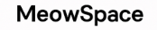
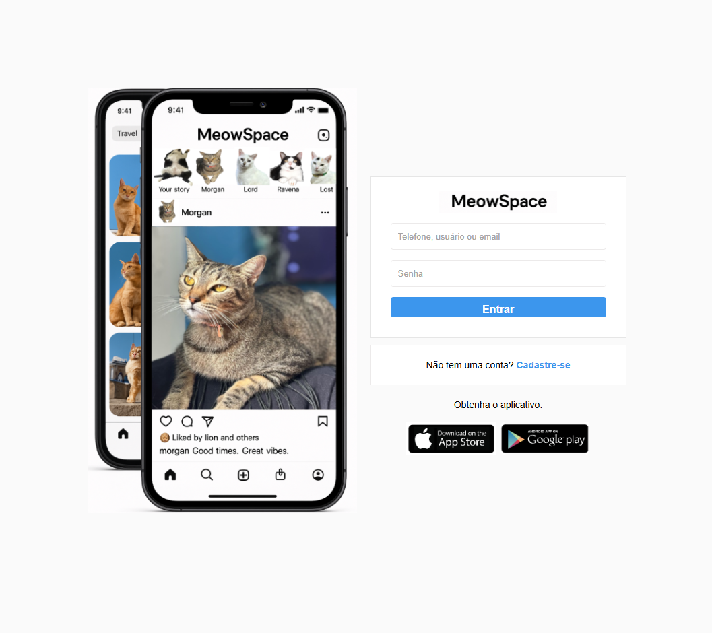
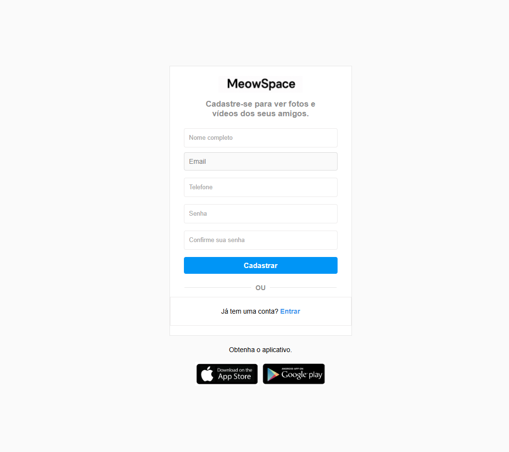

# 🐱 MeowSpace - Clone do Instagram

<div align="center">
  

  [](https://html.com/)
  [](https://www.w3.org/Style/CSS/)
  [](https://www.javascript.com/)
</div>

## 📱 Sobre o Projeto

O MeowSpace é um clone do Instagram desenvolvido com HTML, CSS e JavaScript puro. O projeto foi criado com o objetivo de demonstrar habilidades em desenvolvimento front-end, incluindo validações de formulário, responsividade e boas práticas de UX/UI.

### 🎯 Funcionalidades Implementadas

- **Página de Login**
  - Validação de email e telefone
  - Validação de senha
  - Feedback visual de erros
  - Animações suaves
  - Design responsivo

- **Página de Cadastro**
  - Validação de nome completo
  - Validação de email
  - Formatação automática de telefone
  - Validação de senha forte
  - Confirmação de senha
  - Mensagens de sucesso/erro
  - Animações interativas

## 🖼️ Screenshots

### Tela de Login
<div align="center">
  
</div>

### Tela de Cadastro
<div align="center">
  
</div>

## 🛠️ Tecnologias Utilizadas

- **HTML5**: Estrutura semântica e acessível
- **CSS3**:
  - Flexbox para layout
  - Animações e transições
  - Media queries para responsividade
  - Variáveis CSS para consistência
- **JavaScript**:
  - Validações de formulário
  - Expressões regulares
  - Manipulação do DOM
  - Eventos e listeners

## 🔍 Validações Implementadas

### Login
- Email válido (formato exemplo@dominio.com)
- Telefone válido (formato (99) 99999-9999)
- Formatação automática do telefone durante a digitação
- Senha forte (mínimo 6 caracteres, incluindo números e caracteres especiais)
- Feedback visual imediato para erros
- Mensagens de erro descritivas

### Cadastro
- Nome completo (apenas letras, mínimo 3 caracteres)
- Email válido
- Telefone formatado automaticamente
- Senha forte (mínimo 6 caracteres, incluindo números e caracteres especiais)
- Confirmação de senha

## 🎨 Design e UX

- Interface limpa e moderna
- Feedback visual imediato
- Animações suaves
- Mensagens de erro claras
- Design responsivo para diferentes dispositivos
- Cores e estilos inspirados no Instagram

## 🚀 Como Executar

1. Clone o repositório:
```bash
git clone https://github.com/salomaonogueira/meowspace.git
```

2. Abra o arquivo `index.html` em seu navegador

## 📝 Testando o Projeto

### Login
- Email: teste@email.com
- Telefone: (11) 99999-9999
- Senha: Teste@123

### Cadastro
- Nome: João Silva
- Email: exemplo@dominio.com
- Telefone: (11) 99999-9999
- Senha: Teste@123

## 🤝 Contribuindo

Contribuições são sempre bem-vindas! Sinta-se à vontade para abrir issues ou enviar pull requests.

## 📄 Licença

Este projeto está sob a licença MIT. Veja o arquivo [LICENSE](LICENSE) para mais detalhes.

---

<div align="center">
  <p>Desenvolvido com ❤️ por [Salomão David]</p>
  <p>Contato: salomao3893@gmail.com</p>
</div>